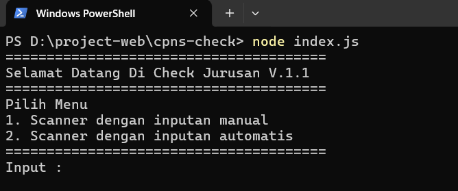

# CPNS Competitor Checker

This application is used to find out the competitor majors of CPNS 2024. This application uses puppeteer to scrape data from PDDIKTI .

This application can help candidates to find out the competitor majors of CPNS 2024 more easily and quickly. With this, candidates can prepare themselves better for the CPNS 2024 selection.

## Features

* Find out the competitor majors of CPNS 2024
* Save data in JSON format

## How to Use

1. Clone this repository to your computer
2. Install dependencies by running the command `npm install`
3. Run the application by running the command `npm start`
4. The application will find out the competitor majors of CPNS 2024 and save it in JSON format

## License

This application is licensed under MIT. You can use, modify, and distribute this application as needed.

